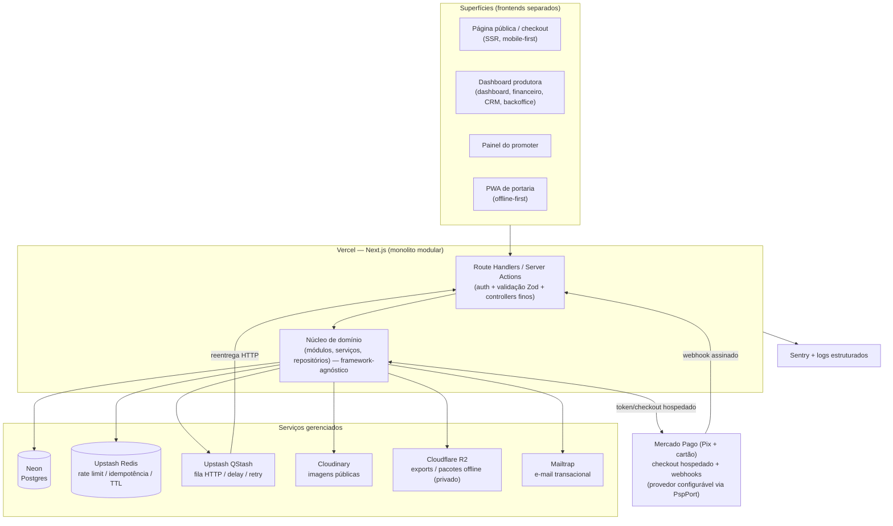

# Arquitetura — SaaS de Ingressos

**Versão:** 0.1 (baseline de arquitetura, anterior ao início das fases)
**Data:** 17 de julho de 2026
**Status:** Proposta para aprovação
**Escopo:** MVP operacional completo descrito no [PRD.md](PRD.md), sob as regras do [CLAUDE_SECURITY_RULES.md](CLAUDE_SECURITY_RULES.md)

> Este documento define **como** vamos construir o produto descrito no PRD. Ele não substitui o PRD (o quê) nem as regras de segurança (limites obrigatórios); ele conecta os dois a decisões técnicas concretas.

---

## 1. Decisões tomadas

| Dimensão | Decisão | Observação |
|---|---|---|
| Linguagem/runtime | **Node.js + TypeScript** | Um só idioma no full-stack; alinhado aos exemplos do CLAUDE_SECURITY_RULES (Prisma, Zod). |
| Estilo arquitetural | **Monolito modular + frontends separados** | Um núcleo de domínio único, organizado por módulos; superfícies de frontend separadas. |
| Deploy inicial | **Vercel + Neon + Upstash + Cloudinary** | Barato e rápido para o piloto; migração planejada quando houver necessidade. |
| Storage privado | **Cloudflare R2** | Free tier 10 GB, zero egress, API S3 (migração trivial). Cloudinary só para imagens públicas. |
| E-mail transacional | **Mailtrap** | Sending API em produção (SPF/DKIM + bounce); sandbox em dev/homologação. |
| PSP inicial | **Mercado Pago** | Primeiro adaptador da `PspPort`; provedor selecionável por configuração para futuros gateways. |
| Time | **Solo / 1–2 devs** | Prioridade máxima em simplicidade operacional e serviços gerenciados. |

### 1.1 Tensão serverless × requisitos, e como resolvemos

A Vercel executa **funções efêmeras e de curta duração** — não há processo persistente para rodar workers, filas em memória ou locks de aplicação. Três requisitos críticos do PRD dependeriam disso num servidor tradicional. Resolução adotada:

| Necessidade (PRD) | Em servidor tradicional | Nesta arquitetura serverless |
|---|---|---|
| Processar webhooks do PSP de forma idempotente (FR-PAY-006/007) | worker consumindo fila | Webhook persiste o evento cru e **enfileira no Upstash QStash**, que reentrega via HTTP com retry a um handler idempotente |
| Retentativa de e-mail, exports, expiração de reserva (FR-NOT-006, FR-INV-007) | cron + worker | **QStash (delay/retry)** + **Vercel Cron** para varreduras periódicas |
| Não permitir overselling sob concorrência (FR-INV-008, BR-INV-002) | lock/transação em processo longo | **UPDATE condicional atômico no Postgres** (sem lock de aplicação) — ver §8 |

**Conclusão:** a stack escolhida atende aos NFRs desde que a lógica assíncrona seja construída sobre **QStash + Vercel Cron** e a consistência de inventário/financeiro seja garantida **no banco** (transações e operações atômicas), nunca em memória da função.

### 1.2 Gaps da stack inicial — decisões tomadas

1. **Storage privado: Cloudflare R2.** Cloudinary fica restrito a **imagens públicas de evento** (transformação, CDN). Exports de compradores, CSVs financeiros e pacotes offline (dados sensíveis, LGPD, FR-FIN-009/CRM-006) vão para **R2** com URL assinada e expiração. Motivos: free tier de 10 GB, **zero custo de egress** e **API compatível com S3** — a migração futura para AWS S3 troca endpoint/credenciais, não código. *(Ver §16.)*
2. **PSP inicial: Mercado Pago (DEC-002 resolvida).** Primeiro adaptador da porta `PspPort`; a seleção do provedor é **por configuração**, prevendo múltiplos gateways no futuro. Nada no núcleo depende do Mercado Pago. **Modelo de recebimento:** toda a arrecadação entra na **conta da plataforma**; o repasse à produtora ocorre depois, respeitando uma **janela de carência** (desistências/devoluções) definida nos termos de uso. *(Ver §10 e §12.)*
3. **E-mail transacional: Mailtrap.** Em produção, o **Email Sending API** com domínio autenticado (SPF/DKIM) e webhooks de bounce (FR-NOT / §14.2 do PRD); o **sandbox** do Mailtrap serve dev/homologação sem risco de disparo real. Free tier (~1.000 e-mails/mês) cobre o início; como é uma porta (`MailerPort`), trocar de provedor depois é trivial. *(Ver §16.)*

---

## 2. Visão geral



Princípio-guia: **as funções serverless são apenas a borda**. Toda regra de negócio vive no núcleo de domínio, que não conhece Next.js nem Vercel — o que mantém a promessa de migração futura para infra mais robusta sem reescrever o coração do produto.

---

## 3. Estrutura de repositório

Monorepo simples (um só time), com o núcleo isolado dos frameworks.

```text
/
├─ apps/
│  ├─ web/            # Next.js: página pública + dashboard + promoter + backoffice + API
│  └─ checkin/        # PWA de portaria (Next.js ou Vite+React), deploy separado, offline-first
├─ packages/
│  ├─ core/           # NÚCLEO DE DOMÍNIO — sem dependência de Next/Vercel
│  │  ├─ modules/     # um diretório por módulo de domínio (ver §5)
│  │  ├─ shared/      # tipos, erros, dinheiro (inteiro), resultado, clock, ids
│  │  └─ ports/       # interfaces: PSP, Mailer, Storage, Queue, Cache
│  ├─ db/             # Prisma schema, migrations, client, seed
│  └─ config/         # validação de env (Zod) no boot, constantes
├─ docs/
└─ ...
```

**Regra de dependência (obrigatória):** `apps/*` → `packages/core` → `packages/db`/`ports`. O núcleo **nunca** importa de `apps/*`. Adaptadores concretos (Prisma, QStash, Resend, PSP) implementam as `ports` e são injetados na borda. Isso é o que permite trocar de infra depois.

### 3.1 Sobre "frontends separados" nesta stack

Recomendação concreta para time solo na Vercel:

- **`apps/web`** concentra as superfícies de *staff/comprador* como **route groups** do App Router: `(public)`, `(dashboard)`, `(promoter)`, `(backoffice)`. São logicamente separadas (layouts, permissões e navegação distintos), mas compartilham build, sessão e a API — menos deploys para operar.
- **`apps/checkin`** é um **deploy separado de verdade**. Justificativa: é PWA offline-first (service worker, IndexedDB), tem cadência de release e superfície de risco diferentes, e precisa funcionar sem a aplicação principal. É onde a separação física paga.

> Se você preferir separar também dashboard/promoter/backoffice em deploys próprios (ex.: `app.`, `promoter.`, `admin.`), é viável (múltiplos projetos Vercel apontando ao mesmo núcleo/DB), ao custo de mais pipelines. Para 1–2 devs, recomendo começar unificado e separar sob demanda. **Me diga se quer o contrário.**

---

## 4. Camadas e fluxo de uma requisição

```text
Route Handler / Server Action  (borda)
  → autentica sessão (staff) ou valida token (comprador)
  → valida input com schema Zod (allowlist; rejeita campos extras)
  → resolve escopo do tenant (organization_id) a partir da sessão, NUNCA do body
  → chama Serviço do módulo (caso de uso)
        → aplica regra de negócio + autorização por recurso (ownership/tenant)
        → usa Repositório (sempre escopado por organização)
        → publica efeitos assíncronos via Queue port (QStash)
  → mapeia resultado/erro para resposta (mensagem genérica; sem stack trace)
```

Isto materializa as seções 5–10, 19 e 26 do CLAUDE_SECURITY_RULES: validação, autorização no backend, sem mass assignment, saída mínima, erros seguros.

---

## 5. Módulos de domínio (mapa para os épicos)

Cada módulo tem seu próprio serviço, repositório e testes. Fronteiras alinhadas ao PRD.

| Módulo (`packages/core/modules/*`) | Épico PRD | Responsabilidade central |
|---|---|---|
| `identity` | EP-01 | Organizações, usuários, membership, papéis/permissões, convites |
| `auth` | EP-01 | Sessão staff, senha (Argon2id/bcrypt), MFA, rate limit, reautenticação |
| `events` | EP-02 | Evento, estados, local/setor/portão, publicação |
| `inventory` | EP-02 | Tipos de ingresso, lotes, reserva atômica, capacidade |
| `checkout` | EP-03 | Página pública, carrinho, cupom, atribuição, dados do comprador |
| `orders` | EP-04 | Pedido, itens, estados, idempotência |
| `payments` | EP-04 | Porta PSP, pagamentos, webhooks, reembolso, chargeback |
| `tickets` | EP-05 | Emissão, token único, QR, transferência, bloqueio, cortesia |
| `promoters` | EP-06 | Perfil, links/cupons, atribuição, comissão versionada, metas |
| `analytics` | EP-07 | Métricas de funil/dashboard, definições, eventos de produto |
| `customers` | EP-07/08 | Comprador consolidado, participantes, CRM, consentimento, segmentos |
| `checkin` | EP-09 | Operadores, dispositivos, validação on/offline, pacote, sincronização |
| `support` | EP-10 | Busca global, linha do tempo, ações assistidas, notas, impersonação |
| `finance` | EP-11 | Ledger imutável, taxas, comissões consolidadas, repasses, conciliação |
| `notifications` | EP-12 | Envio, retentativa, templates, reenvio sem duplicar efeito |
| `audit` | EP-12 | Trilha imutável de ações sensíveis |

Comunicação entre módulos: por **chamada direta de serviço** (in-process) ou **evento assíncrono via QStash** quando o efeito for desacoplável (ex.: `payment_approved` → emitir ingressos, atualizar comissão, enviar e-mail, registrar analytics). Nada de acessar tabela de outro módulo diretamente.

---

## 6. Dados, multi-tenancy e modelagem

- **ORM:** **Prisma** (coerente com o CLAUDE_SECURITY_RULES). Para os pontos críticos de concorrência, descemos para **SQL/transação explícita** via Prisma (`$transaction`, `$queryRaw` parametrizado) — ORM não abstrai bem operações atômicas condicionais.
- **Neon:** connection string **pooled** (PgBouncer) para os handlers serverless; string **direta** só para migrations. Neon *branching* serve para ambientes de dev/preview.
- **Isolamento multi-tenant (defesa em profundidade):**
  1. `organization_id` obrigatório em toda tabela de negócio da produtora.
  2. **Repositórios escopados por padrão** — a assinatura exige o `organizationId` do contexto; não existe query "solta". É a defesa primária contra IDOR/BOLA (CLAUDE_SECURITY_RULES §6–7).
  3. **RLS no Postgres como hardening** (Fase 7): política por `organization_id` usando `SET app.current_org`. Fica como camada extra, não como única defesa.
- **Dinheiro:** **inteiro na menor unidade** (centavos), tipo `BigInt`. Proibido ponto flutuante (BR-FIN-001).
- **Datas:** UTC no banco; exibição no fuso do evento/usuário.
- **IDs públicos:** não sequenciais previsíveis (UUID/ULID) onde a exposição amplia risco; tokens de ingresso são segredo (ver §14).
- **Imutabilidade:** ledger e auditoria são *append-only*; correção por lançamento compensatório, nunca update destrutivo (BR-FIN-002, FR-AUD-004).

---

## 7. Idempotência (transversal)

Requisito duro (NFR-REL-001/005). Padrão único no projeto:

- **Chave de idempotência** em toda operação que cria efeito externo/financeiro: criação de pagamento, emissão de ingresso, reembolso, processamento de webhook, envio de e-mail.
- Armazenada em tabela `idempotency_key` (persistente, com resultado) e/ou Upstash Redis (janela curta). Segunda chamada com a mesma chave retorna o **mesmo resultado**, sem repetir o efeito.
- **Webhooks:** persistir o evento cru **antes** de processar; deduplicar por `provider_event_id`; processamento tolerante a duplicata e fora de ordem (FR-PAY-006/007, §18 das regras).

---

## 8. Concorrência de inventário (o ponto mais crítico)

Objetivo: **zero overselling** mesmo com rajada de abertura/virada de lote (FR-INV-004/008, BR-INV-001/002, NFR-PER-007), sem depender de lock de aplicação (que não existe em serverless).

**Estratégia: UPDATE condicional atômico.** O lote mantém contadores; a reserva só é criada se couber, numa única instrução atômica:

```sql
-- conceito (parametrizado, dentro de transação)
UPDATE sales_batch
   SET reserved = reserved + $qty
 WHERE id = $batchId
   AND (sold + reserved + $qty) <= quantity_total
RETURNING id;
-- 0 linhas retornadas ⇒ sem disponibilidade ⇒ recusar reserva
```

- Reserva recebe **expiração** (TTL) persistida; job do QStash + varredura por Vercel Cron **liberam de forma idempotente** (BR-INV-003: página atualizada não reativa reserva expirada).
- Confirmação da reserva move `reserved → sold` só na transição válida do pedido (pago/cortesia) (FR-INV-006).
- Cortesias que consomem capacidade entram no mesmo cálculo (BR-INV-001).
- **Testes de concorrência obrigatórios** (DoD §22.3): N requisições simultâneas não ultrapassam a capacidade.

---

## 9. Assíncrono, filas e agendamento

| Efeito | Mecanismo | Garantia |
|---|---|---|
| Processar webhook do PSP | QStash reentrega ao handler | retry + idempotência |
| Emitir ingressos após pagamento | evento `payment_approved` → QStash | idempotente por pedido/item |
| Retentativa de e-mail | QStash com backoff | registrada e reenviável (FR-NOT-006/07) |
| Expirar reservas | Vercel Cron (varredura) + TTL | liberação única |
| Exports/relatórios pesados | QStash → gera arquivo → storage privado → link assinado | assíncrono (NFR-PER-006) |
| Reconciliação/conciliação | Vercel Cron | reprodutível a partir do ledger |

Toda mensagem carrega **correlation id** ponta a ponta (NFR-REL-003) para rastreio API → fila → PSP → emissão.

---

## 10. Pagamentos e a porta do PSP

- PSP tratado como **porta** (`ports/psp.ts`): `createPixCharge`, `createCardCharge`, `refund`, `verifyWebhook`, `getTransaction`. Núcleo depende só da interface; o adaptador concreto (DEC-002) é injetado.
- **PCI reduzido (SAQ-A):** cartão sempre via **tokenização/checkout hospedado do PSP**; a aplicação **nunca** vê PAN/CVV (FR-CHK-014, NFR-SEC-008). Nada de dado de cartão em log/tela (FR-PAY-017).
- **Pix:** só marca aprovado após **confirmação do PSP** (BR-PAY-001, FR-PAY-020) — nunca pela visualização do QR.
- **Webhooks:** assinatura verificada, timestamp contra replay, idempotência, reconciliação por consulta ao PSP em caso de inconsistência (§18 das regras).
- Estados de pedido/pagamento/ingresso independentes e correlacionáveis (FR-PAY-002; máquinas de estado no §11 do PRD).
- **Provedor inicial: Mercado Pago** (Pix dinâmico, cartão tokenizado via Checkout Bricks/API, webhooks assinados, sandbox). A escolha do adaptador é **configurável por ambiente/organização** (`PSP_PROVIDER`), permitindo adicionar Pagar.me/Stone, Asaas etc. sem alterar o núcleo. Requisitos de qualquer novo adaptador: implementar `PspPort` completo + passar a mesma suíte de testes de contrato (webhook duplicado, fora de ordem, reembolso, expiração).
- **Sem split nativo no MVP:** a plataforma é a recebedora única; o repasse à produtora é uma operação do módulo `finance`, não do PSP (ver §12). Isso simplifica o adaptador (sem KYC de recebedor por produtora no PSP) e mantém a opção de split nativo como evolução futura do adaptador, sem mudar o núcleo.

---

## 11. Autenticação e autorização

Dois contextos distintos:

**A) Staff (produtora, promoter, portaria, backoffice)**
- Sessão revogável com expiração/rotação (FR-AUTH-003, NFR-SEC-006). Recomendação: **Auth.js com sessão em banco (Neon)** — permite revogar e listar sessões, ao contrário de JWT stateless puro.
- Senha com **Argon2id/bcrypt** (NFR-SEC-005); nunca em texto puro; sem hashing manual.
- **Rate limit** (Upstash) em login/reset/reenvio (FR-AUTH-006, §20 das regras).
- **MFA** para proprietário/financeiro/admin plataforma (FR-AUTH-005, DEC-012) e **reautenticação** em ações sensíveis (FR-AUTH-004).
- **RBAC** por `membership` (usuário × organização × papel × permissões). Usuário pode pertencer a várias organizações com permissões independentes (FR-ORG-006). Autorização sempre no backend, por recurso.

**B) Comprador (público)**
- **Sem senha obrigatória** (FR-CHK-005): checkout como convidado.
- Acesso ao ingresso por **link seguro** (token assinado, TTL) e **magic link** por e-mail para recuperar/reenviar (FR-TKT-004/006). QR do ingresso é um **token de validação separado**, que não expõe dado pessoal (FR-TKT-003).

Matriz de papéis e regras: §8 do PRD é a fonte de verdade; implementada como allowlist de permissões por caso de uso.

---

## 12. Financeiro e ledger

- **Ledger append-only** (`LedgerEntry`): venda, desconto, taxa, custo PSP, reembolso, chargeback, comissão, repasse (FR-FIN-001/002).
- Relatórios **reprodutíveis a partir dos lançamentos** (NFR-REL-006); estimado ≠ liquidado claramente separados (BR-FIN-003).
- Comissão **versionada** (`CommissionRule`): alteração não retroage sem operação explícita e auditada (BR-PRM-006). Comissão só sobre item pago, não reembolsado e elegível (BR-PRM-004); reembolso/chargeback estorna (FR-PRM-011).
- **Modelo de repasse (DEC-002):** a plataforma é a **recebedora única** — todo pagamento liquida na conta da plataforma; não usamos split nativo do PSP no MVP.
  - **Janela de carência** antes da elegibilidade do repasse: parâmetro configurável (`payout_hold_days`, default **3 dias** para desistências/devoluções conforme termos de uso), **sem deploy** para alterar (NFR-MNT-004).
  - Elegibilidade calculada a partir do ledger: `repasse elegível = vendas liquidadas pelo PSP − reembolsos − chargebacks − taxa da plataforma − custo PSP`, respeitada a carência. O estado segue a máquina do PRD §11.6 (`estimado → elegível → em_processamento → realizado`).
  - **Duas janelas distintas que o ledger separa:** (a) carência de desistência (~3 dias) e (b) **risco de chargeback de cartão, que se estende por meses** após a venda. O repasse não espera (b); portanto chargeback pós-repasse gera **lançamento compensatório com saldo devedor da produtora**, abatido do próximo repasse ou cobrado conforme contrato (risco já mapeado no PRD §19).
  - **MVP:** repasse executado externamente (transferência manual) e **registrado** com referência/evidência e responsável (FR-FIN-013). **Futuro:** repasse automático via API, sem mudança no modelo de dados — apenas um executor a mais sobre a mesma elegibilidade.
  - Liquidação do PSP condiciona a elegibilidade: Pix liquida rápido; cartão parcelado tem prazos próprios do Mercado Pago — o repasse considera **valor liquidado**, não valor aprovado (BR-FIN-003).
  - ⚠️ **Revisão jurídica obrigatória** da janela de desistência nos termos de uso: o art. 49 do CDC prevê **7 dias** de arrependimento para compras à distância, e sua aplicação a ingressos de eventos tem interpretação divergente nos tribunais. A janela de 3 dias precisa de validação jurídica antes da produção (aviso do próprio PRD). O parâmetro ser configurável protege a arquitetura dessa incerteza.

---

## 13. Check-in online/offline (PWA)

- **`apps/checkin`**: PWA com service worker; leitura de QR por câmera (FR-CIN-003).
- **Online:** valida estado/evento/setor; unicidade de check-in ativo garantida por **constraint no banco** + transação (BR-CIN-001/002).
- **Offline:** pacote assinado com **validade** e apenas dados necessários (FR-CIN-011/012, BR-CIN-005), guardado em **IndexedDB**; dedupe local no dispositivo (BR-CIN-003); **sincronização idempotente** ao voltar a rede (FR-CIN-016/017); **conflitos entre dispositivos detectados na sincronização** e sinalizados (FR-CIN-014). Estratégia operacional de divisão por portão/setor reduz conflito (FR-CIN-015).
- Sessão de operador expira e é **revogável remotamente** (FR-CIN-021); dados locais removidos ao encerrar/expirar (BR-CIN-006).
- Pacote offline é **dado privado** → storage privado assinado, não Cloudinary.

---

## 14. Segurança aplicada (mapa ao CLAUDE_SECURITY_RULES)

| Regra | Onde é atendida nesta arquitetura |
|---|---|
| §2 Não confiar em input | Validação Zod na borda; escopo de tenant vem da sessão, não do body |
| §6–7 Autorização / IDOR / tenant | Repositórios escopados por `organization_id` + RLS futura + testes BOLA |
| §8 Mass assignment | DTOs/allowlist por caso de uso; nunca `data: req.body` |
| §10 Injection | Prisma parametrizado; allowlist para ordenação/filtro |
| §13–15 Dados sensíveis / erros | Seleção explícita de campos; erro genérico; sem stack trace |
| §16 Uploads | Validação de tipo/assinatura; storage privado; sem execução |
| §18 Webhooks | Assinatura + timestamp + idempotência + reconciliação |
| §19 Pagamentos | Preço/comissão/status no backend; PSP hospedado; idempotência |
| §20–21 Rate limit / CORS / headers | Upstash rate limit; allowlist de origem; CSP/HSTS/etc. |
| §30/38 Testes | Testes positivos e negativos; regressão para cada fix |

Segredos: **Vercel Environment Variables / secret store**, validados no boot por Zod (`packages/config`); nunca no repositório (NFR-SEC-004).

---

## 15. Observabilidade

- **Sentry** (já conectado ao ambiente) para erros e tracing (NFR-OBS-001).
- **Logs estruturados** (pino) com correlation id; **auditoria de negócio separada dos logs técnicos** (NFR-OBS-004), imutável (FR-AUD-004).
- Alertas para falha de pagamento, backlog de fila, erro de emissão, divergência de inventário, indisponibilidade (NFR-OBS-002).
- Painel de saúde + runbook para o dia do evento (NFR-OBS-005).

---

## 16. Storage e integrações externas

| Uso | Serviço | Privacidade |
|---|---|---|
| Imagens de evento | **Cloudinary** | público, com CDN/transformação |
| Exports (compradores, financeiro), pacotes offline | **Cloudflare R2** (API S3; migração p/ S3 = trocar endpoint) | **privado, URL assinada com expiração, auditado** |
| E-mail transacional | **Mailtrap** (Sending API em prod; sandbox em dev/homolog.) | domínio autenticado (SPF/DKIM), webhooks de bounce, sem vazar token do ingresso |
| PSP | **Mercado Pago** via `PspPort` (provedor configurável) | checkout hospedado / tokenização |

---

## 17. Ambientes, configuração e CI

- **Ambientes:** `development` (Neon branch), `preview` (por PR na Vercel) e `production` separados (NFR-PRV-008: sem dado real fora de produção sem anonimização).
- **Migrations:** Prisma Migrate, versionadas e revisáveis; string direta do Neon só aqui.
- **CI:** lint + typecheck + testes (unitário/integração + concorrência/idempotência para fluxos críticos) antes do deploy; verificação de dependências (NFR-SEC-010).
- **Feature flags** para liberar funções de risco no piloto (NFR-MNT-005).

---

## 18. Mapa Fases (PRD §21) → Módulos/Infra

| Fase | Entrega | Módulos | Infra ativada |
|---|---|---|---|
| 1 Fundação | Evento configurável, sem venda | identity, auth, events, inventory, audit | Neon, Vercel, secrets, Cloudinary |
| 2 Motor de vendas | 1ª venda ponta a ponta (homolog.) | checkout, orders, payments, tickets, notifications | QStash, Mercado Pago (sandbox), Mailtrap, Redis |
| 3 Promoters | Proposta comercial validável | promoters, analytics | — |
| 4 Operação/suporte | Exceções sem tocar o banco | support, tickets (transf./bloqueio), audit completo | Cloudflare R2 |
| 5 Financeiro/CRM | Fechamento reprodutível | finance, customers/CRM | exports assíncronos |
| 6 Check-in | Simulação de portaria | checkin (`apps/checkin` PWA) | pacote offline, sync |
| 7 Hardening/piloto | Piloto autorizado | (transversal) | RLS, carga/concorrência, testes de segurança, plantão |

---

## 19. Decisões de produto que travam arquitetura (do PRD §20.2)

Precisam ser resolvidas **antes** das fases indicadas:

| DEC | Impacto arquitetural | Trava a fase |
|---|---|---|
| DEC-002 PSP / split | **Resolvida.** Mercado Pago; plataforma como recebedora única; repasse posterior com carência configurável (default 3 dias, sujeito a revisão jurídica — ver §12); MVP com repasse externo registrado (FR-FIN-013) | — |
| DEC-003 Taxa da plataforma | **Resolvida.** Percentual configurável **por evento** (`platformFeeBps`) sobre o valor do ingresso (após desconto). Absorção configurável por evento (`feeMode`): `BUYER` (taxa somada ao total do comprador) ou `PRODUCER` (deduzida do repasse). A plataforma **absorve o custo do PSP** dentro da sua taxa (não reduz o repasse do produtor). Comissão e repasse: **manuais no MVP** — o sistema exibe status, não executa a transação (FR-FIN-013 repasse externo registrado) | — |
| DEC-004 Base de cálculo de comissão | **Resolvida.** Base configurável por regra: `NOMINAL` (preço cheio, default) ou `AFTER_DISCOUNT` (preço após rateio do desconto do pedido) — BR-PRM-005. Regra versionada com snapshot no lançamento (não retroage — BR-PRM-006) | — |
| DEC-005 Janela de atribuição | **Resolvida (MVP).** Prioridade BR-PRM-002: cupom de promoter > link ativo > cupom sem promoter (só desconto). Um único ref (`?p=CODE`) + UTM capturados no checkout e persistidos em `OrderAttribution`. Atribuição multi-toque com janela temporal fica para evolução | — |
| DEC-006 Reembolso/cancelamento | Estados de pedido/pagamento | Fase 2/4 |
| DEC-010 Retenção de dados/logs | Política de retenção/anonimização | Fase 7 (antes da produção) |
| DEC-012 MFA por papel | Config de auth | Fase 7 (antes da produção) |

---

## 20. Riscos da arquitetura e mitigação

| Risco | Mitigação |
|---|---|
| Cold start / limites de execução na Vercel afetam checkout | Handlers enxutos; trabalho pesado no assíncrono; medir LCP/p95 reais (NFR-PER) |
| Neon serverless: limite de conexões | Connection pooler obrigatório; Prisma configurado para pool |
| Acoplamento acidental ao Next/Vercel | Regra de dependência (núcleo agnóstico) + `ports`/adaptadores |
| Cloudinary usado para dado sensível por engano | Storage privado separado; revisão obrigatória em qualquer upload (regras §16) |
| Lock-in de PSP | Porta plugável; nenhum tipo de domínio expõe o provedor |
| Migração futura de infra | Núcleo e adaptadores isolados; migração troca adaptadores, não o domínio |

---

## 21. Próximos passos

1. **Aprovar este documento** (ou pedir ajustes — ex.: separar mais frontends, trocar Prisma por Drizzle, etc.).
2. Criar o **`AGENTS.md`** (referenciado pelo `CLAUDE.md`) com convenções concretas: layout de pastas, padrão de módulo/serviço/repositório, padrão de erro, padrão de teste, comandos.
3. Resolver as decisões que travam a **Fase 1** (mínimas) e iniciar a Fundação.

---

**Fim do documento.**
